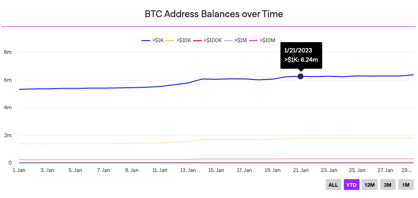
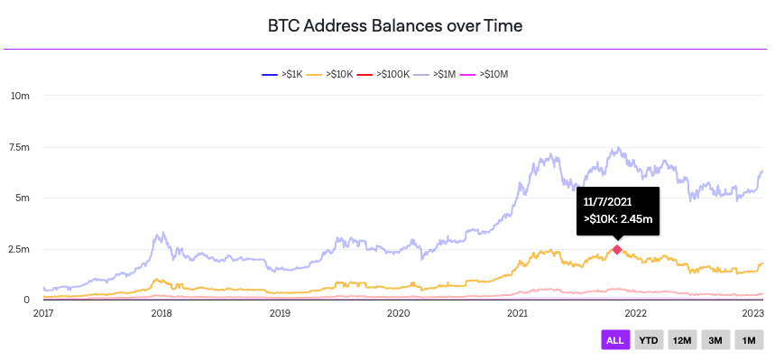

# Mills McIlroy's Next.js Interview Challenge

## Table of Contents

- [My Notes](#introductory-notes)
- [Getting Started](#getting-started)
  - [Prerequisites](#prerequisites)
  - [Running locally](#running-locally)
- [Usage](#usage)
- [Original Challenge Prompt](#original-challenge-prompt)

## My Notes:

1. The original repo for this challenge does not have forking enabled, so I downloaded the zip file instead and created a new repo.
1. I went with npm instead of yarn and removed the yarn.lock file. Though I like yarn as well, it is best practice not to mix package managers to avoid resolution inconsistencies caused by unsynchronized lock files.
1. I decided to try [Nivo](https://github.com/plouc/nivo) for the charting library. In the past, I've used chart.js the most, but it does not work well if SSR is a goal. I chose Nivo because it has an active developer community with over 11k stars on GitHub, is very customizable, and offers HTML + SVG charts that can be server-side rendered.
1. The CSV file provided does not cointain the required data if the goal of each line is to show an address count by tiered USD balance over time, so I used the [Coin Metrics API](https://docs.coinmetrics.io/api/v4/#tag/Timeseries/operation/getTimeseriesAssetMetrics) to get the data instead. I stored the static data in a JSON file in the ./data directory. Using that data, I was able to create a chart that matches the data in the example PNG files provided.
1. Finally, I hit my time-box for this challenge, so I did not get to add functionality to filter the chart by YTD, 12M, 3M and 1M. I would have also liked to make the components a little more generic, so you could show ETH, LTC, DOGE, ETC with little code duplication. And lastly, as a color-blind person myself, I would have liked to customize each line with a pattern or texture to make it easier to distinguish between them.

## Getting Started

These instructions will get you a copy of the project up and running on your local machine for development and testing purposes.

### Prerequisites

- Node.js >= v16.20.0 (needed for Next.js v13.x.x) - [Install Node.js](https://nodejs.org)
- npm >= v9.7.1 - comes pre-installed with Node.js.

### Running locally

1. Install dependencies:

   ```shell
   npm i
   ```

### Usage

1. Start the development server:

   ```shell
   npm run dev
   ```

1. Open [http://localhost:3000](http://localhost:3000) with your browser to see the app.

# Original Challenge Prompt:

## BTC Address Balance Chart Challenge

Create an area or line chart that displays an all-time historic view on btc address balances.

Draw 5 lines in different colors displaying balances

- over $1k
- over $10k
- over $100k
- over $1M
- over $10M

Display a legend that labels each line color.

See "Example Implementation" to get an idea of how the chart should look like.
An ideal implementation would include all features you can see in the example.

### Implementation Notes:

- Use a charting engine you feel most comfortable with
- Use the static data provided (`data/Coin_Metrics_Network_Data_2023-02-02T14-32.csv`) to build an API method
  (`pages/api/btc-addresses`)
  - Format the CSV and return JSON timeseries for your charting engine
  - Call the API to load the data inside of your react component
  - Note: The CSV file is now outdated and won't provide any data after 02/2023 but you could compare your implementation with our example screenshot by changing your system clock to February 23.
- Make the chart look nice and clean (either by utilizing the example as a design template or give it your personal UI touch)

## Bonus Points

- Add buttons and filter functionality to filter the chart by YTD, 12M, 3M and 1M.
- Improve performance by leveraging server side rendering

## Example Implementation





